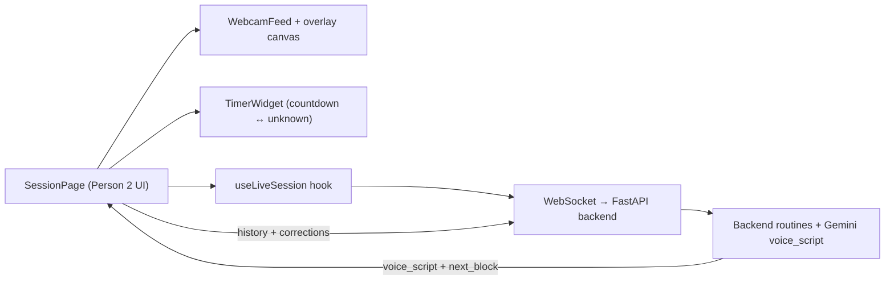

# ChaosFit Live Coach (ADK Bidi)

ChaosFit is a real-time workout coaching app built on Google ADK bidirectional streaming.
It supports:
- live text chat
- live microphone input/output
- live video frame streaming for form feedback

## Tech stack
- FastAPI + WebSocket
- Google ADK (`Runner.run_live` + `LiveRequestQueue`)
- Gemini Live model (native audio recommended)
- Static frontend (adapted from `bidi-demo`)

## Prerequisites
- Python `>=3.10` (tested with Python 3.11)
- `uv` installed (recommended)
- Browser with mic/camera support (latest Chrome/Edge recommended)

## 1) Configure environment
Create/update `.env` in repo root.

### Option A: Gemini Live API (AI Studio key)
```env
GOOGLE_GENAI_USE_VERTEXAI=FALSE
GOOGLE_API_KEY=<YOUR_GOOGLE_API_KEY>
DEMO_AGENT_MODEL=gemini-2.5-flash-native-audio-preview-12-2025
```

### Option B: Vertex AI Live API
```env
GOOGLE_GENAI_USE_VERTEXAI=TRUE
GOOGLE_CLOUD_PROJECT=<YOUR_PROJECT_ID>
GOOGLE_CLOUD_LOCATION=us-central1
DEMO_AGENT_MODEL=gemini-live-2.5-flash-native-audio
```

## 2) Install dependencies
Using `uv`:
```bash
cd /Users/elishebawiggins/projects/chaosfit
uv sync
```

Or using pip/venv: 
```bash
cd /Users/elishebawiggins/projects/chaosfit
python3 -m venv .venv
source .venv/bin/activate
pip install -r backend/requirements.txt
```

## 3) Run the app
```bash
cd /Users/elishebawiggins/projects/chaosfit
uv run uvicorn backend.main:app --reload --host 0.0.0.0 --port 8000
```

Open:
- `http://localhost:8000`

Health check:
- `http://localhost:8000/healthz`

## 4) Using audio + video streaming
1. Click `START AUDIO` to enable microphone streaming.
2. Click `START SESSION` to start the camera preview + begin continuous camera frame streaming.
3. While the session is active, frames are sent at ~1 FPS (`type: "video"`) and the client sends periodic coaching prompts.
4. The model provides short form corrections while stream context is active.
5. Click `END SESSION` to stop camera frame streaming.
6. Click `STOP AUDIO` to stop microphone streaming.

Note: camera preview is kept running even if the model/websocket reconnects; frame uploads pause automatically until connected.

## 5) WebSocket endpoint
Frontend connects to:
- `/ws/{user_id}/{session_id}`

Example:
- `ws://localhost:8000/ws/demo-user/demo-session-123`

### Session control events
Client -> server:
- `{"type":"pause","reason":"manual_pause"}`
- `{"type":"pause","reason":"baby_cry"}`
- `{"type":"resume"}`
- `{"type":"end"}`

Server -> client:
- `{"type":"session_state","status":"active"}`
- `{"type":"session_state","status":"paused","reason":"..."}`
- `{"type":"session_state","status":"resumed"}`
- `{"type":"session_state","status":"ended"}`

While paused, media and text input are not forwarded to the model until resumed.

## Session summaries & reports

When Firestore is enabled (`ENABLE_FIRESTORE=true` plus valid GCP credentials), the backend saves a `session_summaries/{session_id}` document as soon as the client sends `{"type":"end"}`. You can optionally attach summary metadata in the same payload (or inside a nested `summary` field) to capture:

- `exercise_type`: the focus/movement for the workout (string).
- `rep_count`: how many reps/segments were completed (integer).
- `session_goal`: the coaching goal for the workout.
- `form_corrections`: an array of coaching messages or keywords around form corrections.

The server records these fields together with `user_id`, `session_id`, start/end timestamps, and the total interruption count. Request the report over HTTP:

```
GET /reports/session/{session_id}
```

If the document exists, the endpoint returns:

```json
{
  "session_id": "...",
  "user_id": "...",
  "text_report": "... human-readable summary ...",
  "details": { ... raw Firestore fields ... }
}
```

Feed the `text_report` into Person 5’s summary page, and keep the raw `details` for graphs or playback.

## Prompt source of truth
- Prompt contract lives in `backend/live_agent/form_feedback_prompt.py` (`build_live_system_instruction`).
- Active ADK agent (`backend/coach_agent/agent.py`) imports and uses that builder.
- Optional goal override:
  - `COACH_SESSION_GOAL` in `.env`

## Person 4 — Exercise Intelligence (Routines)

### What this module provides
- `backend/routines/exercise_library.json`: curated exercise metadata + Gemini-ready coaching lines.
- `backend/routines/adaptive_scheduler.py`: unknown-time adaptive scheduler (`recommend_next_block`) + resilient history handling.
- `backend/routines/time_mode_engine.py`: timeboxed routine plans (`generate_timeboxed_routine`) + unknown-time seed (`generate_unknown_time_seed`).

### Where it fits in the architecture (one paragraph)
The routines module sits between the live session layer and the model: the backend (Person 3) can generate a timeboxed plan (5/12/20 minutes) or, in unknown-time mode, repeatedly request the next adaptive block based on live session signals (fatigue/form/time remaining). Person 1 can pass the returned `voice_script` into the Live coach prompt so Gemini speaks natural exercise setup + mid-rep corrections, while the client logs `exercise_id` + outcomes for reporting.

### Input/output contracts (integration notes)
- Inputs (unknown-time):
  - `history: list[str]`: previously completed `exercise_id`s (unknown IDs are ignored).
  - `AdaptiveContext`: `time_remaining_sec` (optional), `recent_form_score` 0..1 (optional), `recent_fatigue` 0..1 (optional), `prefer_low_impact` (bool), `equipment_available` (tuple of strings).
- Output (unknown-time):
  - `NextBlock`: `items` (exercise ids + prescriptions) and `voice_script` (ready to speak).
- Output (timeboxed):
  - `RoutinePlan`: ordered blocks with durations + block `voice_script`.

### Current assumptions
- Supported timeboxed durations: **5 / 12 / 20 minutes**.
- Unknown-time mode: returns a short block (default ~120s) meant to be called repeatedly until session end.
- Equipment gating is basic: an exercise is included only if its required equipment is in `equipment_available`.

### Quick usage examples

Generate a 12-minute routine:
```python
from backend.routines import generate_timeboxed_routine, RoutinePreferences

plan = generate_timeboxed_routine(12, prefs=RoutinePreferences(prefer_low_impact=True))
for block in plan.blocks:
    print(block.mode, block.duration_sec)
    print(block.voice_script)
```

Request the next unknown-time block (with history + context):
```python
from backend.routines import AdaptiveContext, load_exercise_library, recommend_next_block

library = load_exercise_library()
history = ["air_squat", "push_up", "unknown_id_from_client"]  # unknown ids are ignored
ctx = AdaptiveContext(time_remaining_sec=None, recent_form_score=0.6, recent_fatigue=0.7, prefer_low_impact=True)
block = recommend_next_block(library, history=history, ctx=ctx, block_duration_sec=120)
print(block.items)
print(block.voice_script)
```

### Exercise library attribution
The exercise library and coaching cues are **manually curated** for this demo (common bodyweight movements and typical coaching language). Wording may be **AI-assisted for clarity**, but content is not medical advice; users should stay within pain-free ranges and modify as needed.

## Person 2 — Frontend Experience (Session UI + sketch overlay)

### Components and responsibilities
- `frontend/src/pages/SessionPage.tsx` connects to `useLiveSession`, renders the webcam preview, drives the timer widget, surfaces transcripts/errors, and pushes exercise history to the backend so Person 3 can query the adaptive scheduler.
- `frontend/src/components/WebcamFeed.tsx` hosts the `<video>` element and keeps the layout/template that the canvas overlay can paint over.
- `frontend/src/components/TimerWidget.tsx` exposes countdown vs unknown-time toggles so the UI matches the requested session type.

### Data flow (mermaid diagram)


### Real-time drawing sketch
The overlay canvas listens to pointer movement above the webcam preview, records recent pointer positions, and paints a ghost path that mirrors the parent’s motion. When Gemini or the live agent flags form corrections (the UI scans transcripts for keywords), the overlay pulses with a tinted circle to reinforce the correction queue. `SessionPage` exposes the `showSketch` toggle so judges can turn the overlay off for accessibility.

### Integration notes
-- Frontend emits the same session control events described above (`start`, `audio`, `pause`, `resume`, `end`) via `useLiveSession`. `SessionPage` also sends the current `sessionGoal` and the countdown duration (if countdown mode is active) as the session begins so the backend can tailor the routine.
-- The history panel lets you add exercise IDs manually; Person 3 can feed this history into `recommend_next_block` so the routines engine avoids repeats.
-- Corrections highlighted by overlay are derived from Gemini transcripts/errors; if Person 1 wants richer correction metadata (e.g., wrist, knee), add it to the WebSocket payload and expose it via `SessionPage` so the expensive overlay logic can switch stroke colors or draw icons.

## Lessons Learned

### FPS and Motion Tracking
- This ADK Live integration is frame-based visual context, not high-frequency motion tracking.
- 1 FPS is the preferred default because it gives:
  - stable end-to-end latency for interactive coaching,
  - lower bandwidth and token/compute pressure,
  - fewer browser encode/backpressure issues,
  - better overall multimodal UX when audio + text + video all run together.
- Full motion analytics (pose tracking at high temporal resolution) is a separate architecture and requires dedicated CV/pose pipelines beyond this ADK frame-stream flow.

### Model Selection (Bidi Native Audio vs `gemini-2.5-flash`)
- For this app's real-time coaching UX, bidi native-audio models are preferred because they support:
  - true duplex conversational flow,
  - lower-friction interruption patterns,
  - better alignment with continuous mic + video stream sessions.
- `gemini-2.5-flash` remains strong for general generation and fallback testing, but it is not the same real-time voice-first interaction pattern as Live bidi native-audio.
- Keep `DEMO_AGENT_MODEL` configurable in `.env` for fallback/testing; use a native-audio bidi model for production coaching behavior.

### Firestore Setup & Exercise Tracking
- **Environment Setup**: Firestore requires `GOOGLE_CLOUD_PROJECT` and `ENABLE_FIRESTORE=true` in `.env`. Authentication works automatically with `gcloud auth login` or service account credentials.
- **Session Summary Race Conditions**: Multiple cleanup handlers (disconnect, exception, normal end) can overwrite session summaries. Always check `session.status != "ended"` before saving to prevent overwriting properly ended sessions.
- **Exercise Detection**: Frontend patterns must match exact exercise library IDs (e.g., `push_up` not `push-ups`, `air_squat` not `squats`). Coach uses library `start_prompt` phrases for detection.
- **Data Flow**: Frontend detects exercise → sends `exercise_update` event → backend tracks in session state → `end` event sends summary → Firestore saves. Any break in this chain results in "unknown" exercise data.
- **Virtual Environment**: Use `uv` or dedicated venv to avoid dependency conflicts. System Python may have different package versions causing import issues.

## Exercise Routine Design
- Keep the **selection heuristic simple and explainable** (fatigue/form/low-impact) so live coaching remains predictable.
- Prefer **deterministic rotation** over randomness for demos; it reduces “why did it pick that?” surprises.
- Treat client input as untrusted: **ignore unknown history IDs** instead of failing mid-session.
- “Unknown-time” flows work best as **small repeatable blocks** with clear voice scripts, not giant generated plans.
- Coaching text matters as much as code: **short, concrete cues** reduce latency and improve comprehension.
### Debugging Session Data Issues
- Check logs for "Exercise update received" vs "Session summary extracted" to verify data flow
- Verify exercise library names match detection patterns exactly
- Look for multiple "Session summary written" entries indicating overwrites
- Use Firestore console to verify actual saved data vs expected data

## Interruption QA Protocol
Run this manual test to confirm natural speech + interruption behavior:
1. Start the app and confirm websocket shows `Connected`.
2. Click `Start Audio` and begin speaking a long prompt (for example, describe a full workout plan).
3. While speaking, switch to risky movement cues (or ask for immediate correction).
4. Confirm the model issues an interruption event:
   - red interruption banner appears,
   - Event Console shows interruption count incrementing,
   - partial agent output is marked as interrupted,
   - subsequent correction turn is delivered.
5. Repeat 3 times in a row without refreshing the page.

## Pause/Resume QA Protocol
1. Start app and confirm websocket is connected.
2. Start Audio and Start Video.
3. Click `Pause Session` and verify:
   - pause banner appears,
   - Event Console shows `session_state: paused`,
   - audio/video/text input is not forwarded.
4. Click `Resume Session` and verify:
   - pause banner disappears,
   - Event Console shows `session_state: resumed`,
   - audio/video/text forwarding resumes.
5. Click `Baby Cry Pause` and verify reason is `baby_cry`.

## Acceptance Criteria
- User can talk naturally with continuous turn-taking.
- Agent can interrupt and provide concise corrective guidance mid-turn.
- UI visibly signals interruption events.
- Interruption count is observable in:
  - frontend Event Console, and
  - backend logs (`Interruption event ... interrupted_count=<n>`).
- Session lifecycle controls work without reconnecting websocket:
  - `active -> paused -> resumed -> ended`.

## Troubleshooting

### `Error loading ASGI app. Could not import module "main"`
Use:
```bash
uv run uvicorn backend.main:app --reload --host 0.0.0.0 --port 8000
```
Do not use `main:app` from repo root.

### Camera/mic permission errors
- Use `http://localhost:8000` (not `0.0.0.0` in browser URL).
- Allow browser camera/mic permissions.
- Prefer latest Chrome/Edge.

### Connected but no model response during video
- Ensure video is running (`Start Video`) and websocket is connected.
- Check `.env` credentials/model.
- Verify periodic coaching messages appear in Event Console.

### Audio events visible in console with `Show audio` unchecked
Hard refresh browser (`Cmd+Shift+R`) to load latest JS.

## Repo layout
- `backend/main.py`: FastAPI app + ADK websocket flow
- `backend/coach_agent/agent.py`: model/instruction config
- `backend/static/`: frontend UI (index/css/js)
- `backend/requirements.txt`: pip dependency fallback
- `pyproject.toml`: uv project config
